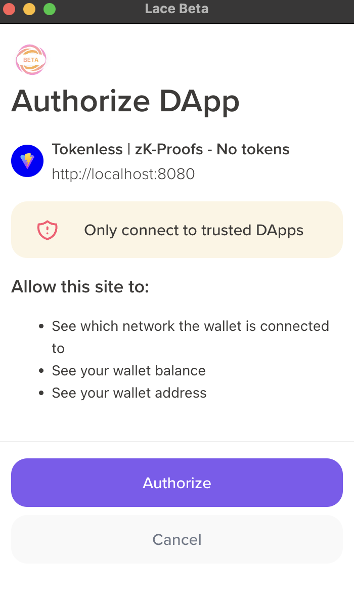
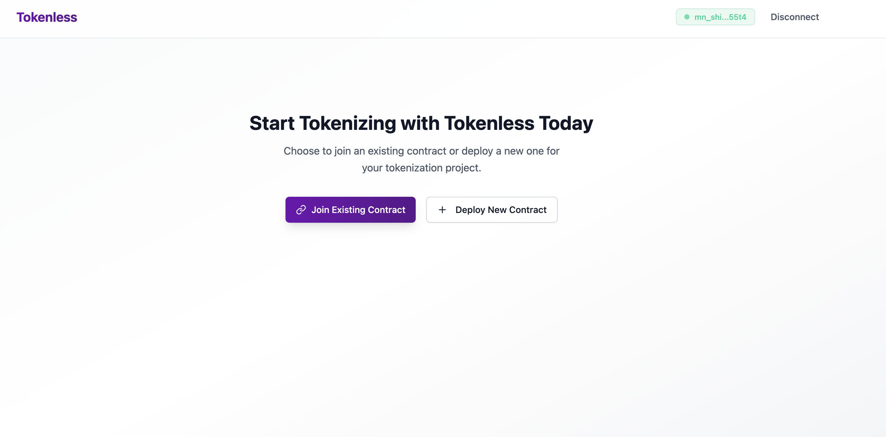
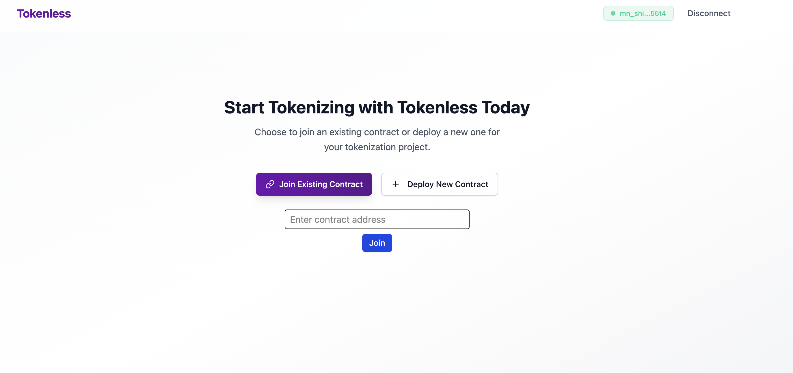
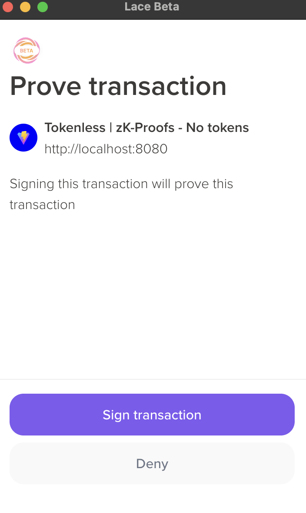
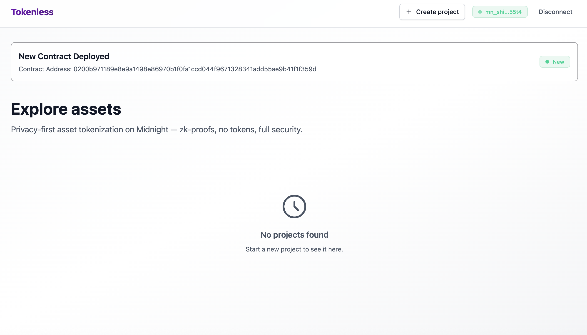

# Tokenless

**Private, Compliant Asset Tokenization on Midnight — No Public Tokens, Full Privacy**

---

## 📌 Overview

Tokenless is a natively Midnight-based asset tokenization system. It enables secure, verifiable, and private representation of investments and participations on-chain—without issuing public or transferable tokens. Zero-knowledge proofs (ZKPs) guarantee user privacy and regulatory compliance, preventing public exposure of balances, identities, or investment patterns.

---

## 🚀 Key Features

- **No public tokens:** No transferable tokens or public balance lists.
- **Privacy by design:** All actions (investment, project creation, withdrawals) are protected by ZKPs.
- **Regulatory compliance:** Supports zk-credentials for KYC, AML, and residency without exposing sensitive data.
- **On-chain verifiability:** All investments and actions are cryptographically auditable and provable.
- **Modular architecture:** Decoupled smart contracts, API, and UI, with privacy logic at every layer.
- **Censorship resistance:** No central points of control or participant exposure.
- **Refunds and flexible management:** Integrated refund mechanisms and project administration.

---

# Setup

Follow these steps to get your environment ready:

---

## 🛠️ Installation & Setup

### 1. Clone the repository

```sh
git clone https://github.com/luislucena16/tokenless.git
cd tokenless
```

### 3. Verify Node.js version

```sh
node -v
# Must be >= 22
```
If not, install the latest Node.js from [nodejs.org](https://nodejs.org/).


### 2. Install dependencies

```sh
yarn install
```

### 3. Fetch ZK params and scripts

Download and prepare the zero-knowledge (ZK) parameters required by the proof server:

```sh
cd packages/cli
curl -O https://raw.githubusercontent.com/bricktowers/midnight-proof-server/main/fetch-zk-params.sh
chmod +x fetch-zk-params.sh
./fetch-zk-params.sh
```

### 4. Configure environment variables

You must set the `COMPACT_HOME` variable so the Compact compiler can be found. This can be done temporarily (for your current session) or permanently (for all terminal sessions).

See the [official documentation to install the Midnight compact compiler](https://docs.midnight.network/develop/tutorial/building/#midnight-compact-compiler).

**For current session only:**
```bash
export COMPACT_HOME=/path/to/compact
```

**For permanent setup:**

**macOS/Linux:**
```bash
# Add to your shell profile
echo 'export COMPACT_HOME=/path/to/compact' >> ~/.bashrc
echo 'export COMPACT_HOME=/path/to/compact' >> ~/.zshrc
# Reload your shell profile
source ~/.bashrc  # or source ~/.zshrc
```

**Windows (PowerShell):**
```powershell
# Set for current user
[Environment]::SetEnvironmentVariable("COMPACT_HOME", "/path/to/compact", "User")
# Or set for current session
$env:COMPACT_HOME = "/path/to/compact"
```

**Windows (Command Prompt):**
```cmd
# Set for current user
setx COMPACT_HOME "/path/to/compact"
# Or set for current session
set COMPACT_HOME=/path/to/compact
```

**After setting the variable, confirm it is set correctly:**
```sh
echo $COMPACT_HOME
```
You should see the path you configured as output.

### 5. Build all packages

```sh
yarn build:all
```

### 7. Launch Midnight infrastructure (TestNet)

```sh
docker compose -f packages/cli/testnet.yml up -d
```

### 8. Configure and launch the UI

#### 8.1 Environment variables

Create a `.env` file in `packages/ui` with:

```env
VITE_NETWORK_ID=TestNet
VITE_LOGGING_LEVEL=trace
```

#### 8.2 Build and start

```sh
cd packages/ui
npx turbo run build
yarn start
```

Go to [http://localhost:8080](http://localhost:8080).

---

## 💡 How It Works

### 1. Install Lace Beta Wallet

To interact with the dApp, you must install the [Lace Beta wallet](https://chromewebstore.google.com/detail/lace-beta/hgeekaiplokcnmakghbdfbgnlfheichg) extension, which is compatible with Midnight and then click to `Connect Wallet`.
> 

---

### 2. Connect your wallet

When you click **Connect Wallet** in the interface. The dApp will automatically detect Lace Beta and prompt you to authorize the connection.
> 

---

### 3. Choose: Join an existing contract or deploy a new one

On the main screen you can:
- **Join Existing Contract:** Join a contract that already exists (ideal for exploring pre-created projects).
- **Deploy New Contract:** Deploy your own contract from scratch.

> 

---

#### 👉 If you choose **Join Existing Contract**

You can join a demo contract with existing projects using the following address:

```
0200e604aad6e0af78d988886ffd20a9742dc09514fe3542ab32f21907ad5463974a
```

Paste this address in the input field and click **Join**.

> 

If you joined successfully, you should see something like this:

> 

---

#### 👉 If you choose **Deploy New Contract**

The dApp will deploy a new contract on the Midnight network. You will be prompted to sign the deployment with your wallet:

> 

Once deployed, you will see an empty project board, ready for you to create your own private investment projects:

> 

---

### 4. Interact with projects

- **Explore existing projects** (if you joined a contract with projects).
- **Create new projects** if you deployed your own contract.
- **Invest, withdraw funds, or request refunds** using zero-knowledge proofs (ZKPs), without exposing sensitive data.

---

### 5. Full privacy

- Contract state (projects, balances, etc.) is queried and updated in real time using observables.
- **The UI never accesses or displays private data:** Everything is managed via ZKPs and controlled access logic.

---

## 🔒 Privacy & Compliance

- **ZKPs for every interaction:** All operations require zero-knowledge proofs.
- **No public balances:** No transferable tokens or investor lists.
- **Demonstrable compliance:** Users can invest and withdraw without disclosing their data.
- **No pattern exposure:** Neither amount nor frequency of investment is public.

---

## 🧪 Development Commands

- **Install dependencies:** `yarn install`
- **Build all:** `yarn build:all`
- **Download ZK params (one-liner):**
  ```sh
  cd packages/cli && \
  curl -O https://raw.githubusercontent.com/bricktowers/midnight-proof-server/main/fetch-zk-params.sh && \
  chmod +x fetch-zk-params.sh && \
  ./fetch-zk-params.sh
  ```
- **Launch infrastructure:** `docker compose -f testnet.yml up -d`
- **Build UI:** `npx turbo run build`
- **Start UI:** `yarn start`

---

## 📂 Project Structure

```
tokenless/
  packages/
    contract/   # Smart contracts (Compact)
    api/        # API and integration logic
    cli/        # Infrastructure and scripts
    ui/         # React + Vite frontend
```

---

## 🧱 Tech Stack

- **Midnight Network** (blockchain & ZKPs)
- **Compact** (smart contract language)
- **React + Vite** (frontend)
- **Yarn + TurboRepo** (monorepo & dependencies)
- **Docker** (local/testnet infrastructure)
- **Pino** (logging)
- **RxJS** (API observables)

---

## 🤝 Contributing

### Contribution Guidelines

This repository is meant to be forked as a starting point for new developments. You can:

1. **Fork** the repository for your own project
2. **Contribute** - Any PR is welcome to improve the template

If contributing:
1. **Fork** the repository
2. **Create** a feature branch (`git checkout -b feature/amazing-feature`)
3. **Commit** your changes (`git commit -m 'feat: add amazing feature'`)
4. **Push** to the branch (`git push origin feature/amazing-feature`)
5. **Open** a Pull Request

### Code Standards

- Use **TypeScript** for all code
- Follow configured **ESLint** and **Prettier**
- Write **tests** for new features
- Document **APIs** and complex functions

### Commit Structure

```
feat: new feature
fix: bug fix
docs: documentation
style: code formatting
refactor: refactoring
test: tests
chore: maintenance tasks
```

## 📝 License

This project is licensed under the MIT License. See the [LICENSE](LICENSE) file for details.

## 🗺️ Roadmap

- [ ] Advanced zk-credential integration for compliance with KYC
- [ ] Improved UI/UX for private onboarding
- [ ] Add new Investor and Issuer sections (portfolio, tx history, properties invested, dashboard)
- [ ] Support for more wallets
- [ ] Contract audit and security testing
- [ ] Extended documentation and integration examples
- [ ] Support for multiple credential issuers
- [ ] zk-credential revocation system
- [ ] Real-time ROI tracking with privacy-preserving data
- [ ] Private messaging between investor and issuer
- [ ] Developer SDK with ZK templates
- [ ] Monitoring & analytics with privacy focus
- [ ] Secondary market controls for issuers
- [ ] Issuer notifications and compliance alerts

## 🆘 Support

If you have issues or questions:

1. Check the [documentation](docs/)
2. Search [existing issues](../../issues)
3. Create a [new issue](../../issues/new)

## 🔗 Useful Links

- [Midnight Network Documentation](https://docs.midnight.network/)
- [Compact Language Guide](https://docs.midnight.network/develop/reference/compact/)
- [Turbo Documentation](https://turbo.build/repo/docs)
- [React Documentation](https://react.dev/)
- [TypeScript Documentation](https://www.typescriptlang.org/docs/)

---

**⭐ If this template is useful to you, consider giving the repository a star!**

---

**Made with ❤️ by the Midnight ecosystem**