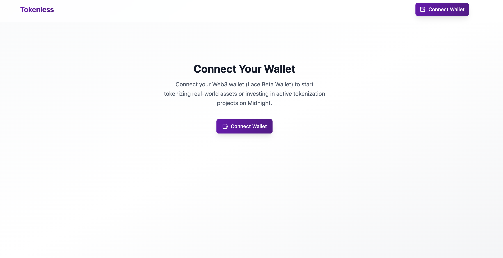
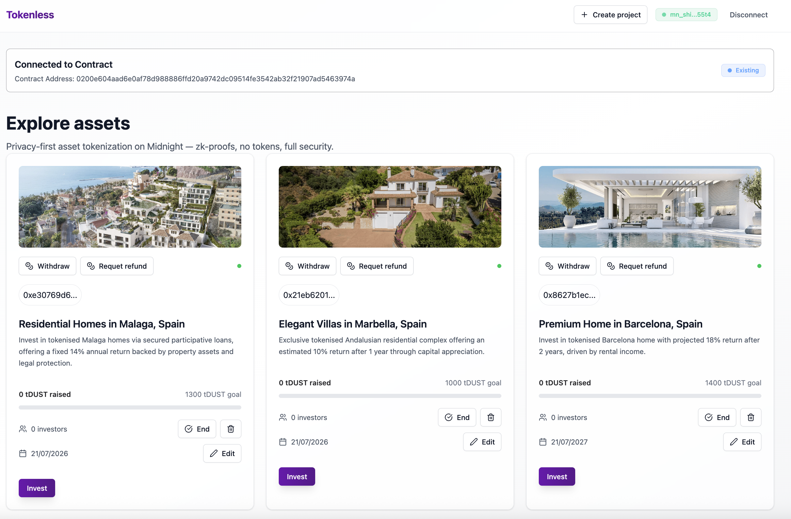

# Tokenless

**Private, Compliant Asset Tokenization on Midnight — No Public Tokens, Full Privacy**

---

## 📌 Overview

Tokenless is a natively Midnight-based asset tokenization system. It enables secure, verifiable, and private representation of investments and participations on-chain—without issuing public or transferable tokens. Zero-knowledge proofs (ZKPs) guarantee user privacy and regulatory compliance, preventing public exposure of balances, identities, or investment patterns.

---

## 🚀 Key Features

- **No public tokens:** No transferable tokens or public balance lists.
- **Privacy by design:** All actions (investment, project creation, withdrawals) are protected by ZKPs.
- **Regulatory compliance:** Supports zk-credentials for KYC, AML, and residency without exposing sensitive data.
- **On-chain verifiability:** All investments and actions are cryptographically auditable and provable.
- **Modular architecture:** Decoupled smart contracts, API, and UI, with privacy logic at every layer.
- **Censorship resistance:** No central points of control or participant exposure.
- **Refunds and flexible management:** Integrated refund mechanisms and project administration.

---

# Setup

Follow these steps to get your environment ready:

---

## 🛠️ Installation & Setup

### 1. Clone the repository

```sh
git clone https://github.com/luislucena16/tokenless.git
cd tokenless
```

### 3. Verify Node.js version

```sh
node -v
# Must be >= 22
```
If not, install the latest Node.js from [nodejs.org](https://nodejs.org/).


### 2. Install dependencies

```sh
yarn install
```

### 3. Fetch ZK params and scripts

Download and prepare the zero-knowledge (ZK) parameters required by the proof server:

- Navigate to the cli folder:
```sh
cd packages/cli
```

- Download the zk parameters in the current folder (packages/cli):
```bash
curl -O https://raw.githubusercontent.com/bricktowers/midnight-proof-server/main/fetch-zk-params.sh
```

- Grant permissions to the script:
```bash
chmod +x fetch-zk-params.sh
```

- Run the script:
```bash
./fetch-zk-params.sh
```

### 4. Configure Compact Compiler

To Install the compiler in your teminal follow these steps:

**Download compiler**

This command will download and run a shell script. It will instruct you how to add the binary directory it uses to your PATH environment variable.

```bash
curl --proto '=https' --tlsv1.2 -LsSf https://github.com/midnightntwrk/compact/releases/latest/download/compact-installer.sh | sh
```

**Update compiler**

Once you've done this, the compact command line tool is available to use. This tool has a number of useful subcommands that can be invoked. For instance, to update the toolchain to the latest version, you will run the command:

```bash
compact update
```

The output will look something like this (on an Apple Silicon macOS machine, for instance):

```bash
compact: aarch64-darwin -- 0.24.0 -- installed
compact: aarch64-darwin -- 0.24.0 -- default.
```

**Check new version available**

You can check if there is a new version available using the check subcommand like this:

```bash
compact check
```

If there is a new version available, you will see something like:

```
compact: aarch64-darwin -- Update Available -- 0.24.0
compact: Latest version available: 0.24.0.
```

This is reporting that you are on version 0.24.0 and that 0.25.0 is available.

**Note:**
You will not actually see this output until there is a new version available. Instead, you will see that you are on the latest version:

```bash
compact: aarch64-darwin -- Up to date -- 0.24.0
```

**Invoking the Compiler**

In addition to keeping the toolchain updated, the compact tool will also be the official supported way to invoke all the toolchain tools themselves. For the time being, the only such tool is the compiler, but we will be building out more tools in the future. The compiler can be invoked with the compile subcommand:

```bash
compact compile <contract file> <output directory>
```

You can see and learn more information, commands about the compiler here: [compact developer tools](https://docs.midnight.network/blog/compact-developer-tools)

### 5. Build all packages

```sh
yarn build:all
```

### 7. Launch Midnight infrastructure (TestNet)

```sh
docker compose -f packages/cli/testnet.yml up -d
```

### 8. Configure and launch the UI

#### 8.1 Environment variables

Create a `.env` file in `packages/ui` with:

```env
VITE_NETWORK_ID=TestNet
VITE_LOGGING_LEVEL=trace
```

#### 8.2 Build and start

```sh
cd packages/ui
npx turbo run build
yarn start
```

Go to [http://localhost:8080](http://localhost:8080).

---

## 💡 How It Works

### 1. Install Lace Beta Wallet

To interact with the dApp, you must install the [Lace Beta wallet](https://chromewebstore.google.com/detail/lace-beta/hgeekaiplokcnmakghbdfbgnlfheichg) extension, which is compatible with Midnight and then click to `Connect Wallet`.
> 

---

### 2. Connect your wallet

When you click **Connect Wallet** in the interface. The dApp will automatically detect Lace Beta and prompt you to authorize the connection.
> 

---

### 3. Choose: Join an existing contract or deploy a new one

On the main screen you can:
- **Join Existing Contract:** Join a contract that already exists (ideal for exploring pre-created projects).
- **Deploy New Contract:** Deploy your own contract from scratch.

> 

---

#### 👉 If you choose **Join Existing Contract**

You can join a demo contract with existing projects using the following address:

```
0200e604aad6e0af78d988886ffd20a9742dc09514fe3542ab32f21907ad5463974a
```

Paste this address in the input field and click **Join**.

> 

If you joined successfully, you should see something like this:

> 

---

#### 👉 If you choose **Deploy New Contract**

The dApp will deploy a new contract on the Midnight network. You will be prompted to sign the deployment with your wallet:

> 

Once deployed, you will see an empty project board, ready for you to create your own private investment projects:

> 

---

### 4. Interact with projects

- **Explore existing projects** (if you joined a contract with projects).
- **Create new projects** if you deployed your own contract.
- **Invest, withdraw funds, or request refunds** using zero-knowledge proofs (ZKPs), without exposing sensitive data.

---

### 5. Full privacy

- Contract state (projects, balances, etc.) is queried and updated in real time using observables.
- **The UI never accesses or displays private data:** Everything is managed via ZKPs and controlled access logic.

---

## 🔒 Privacy & Compliance

- **ZKPs for every interaction:** All operations require zero-knowledge proofs.
- **No public balances:** No transferable tokens or investor lists.
- **Demonstrable compliance:** Users can invest and withdraw without disclosing their data.
- **No pattern exposure:** Neither amount nor frequency of investment is public.

---

## 🧪 Development Commands

- **Install dependencies:** `yarn install`
- **Build all:** `yarn build:all`
- **Download ZK params (one-liner):**
  ```sh
  cd packages/cli && \
  curl -O https://raw.githubusercontent.com/bricktowers/midnight-proof-server/main/fetch-zk-params.sh && \
  chmod +x fetch-zk-params.sh && \
  ./fetch-zk-params.sh
  ```
- **Launch infrastructure:** `docker compose -f testnet.yml up -d`
- **Build UI:** `npx turbo run build`
- **Start UI:** `yarn start`

---

## 📂 Project Structure

```
tokenless/
  packages/
    contract/   # Smart contracts (Compact)
    api/        # API and integration logic
    cli/        # Infrastructure and scripts
    ui/         # React + Vite frontend
```

---

## 🧱 Tech Stack

- **Midnight Network** (blockchain & ZKPs)
- **Compact** (smart contract language)
- **React + Vite** (frontend)
- **Yarn + TurboRepo** (monorepo & dependencies)
- **Docker** (local/testnet infrastructure)
- **Pino** (logging)
- **RxJS** (API observables)

---

## 🤝 Contributing

### Contribution Guidelines

This repository is meant to be forked as a starting point for new developments. You can:

1. **Fork** the repository for your own project
2. **Contribute** - Any PR is welcome to improve the template

If contributing:
1. **Fork** the repository
2. **Create** a feature branch (`git checkout -b feature/amazing-feature`)
3. **Commit** your changes (`git commit -m 'feat: add amazing feature'`)
4. **Push** to the branch (`git push origin feature/amazing-feature`)
5. **Open** a Pull Request

### Code Standards

- Use **TypeScript** for all code
- Follow configured **ESLint** and **Prettier**
- Write **tests** for new features
- Document **APIs** and complex functions

### Commit Structure

```
feat: new feature
fix: bug fix
docs: documentation
style: code formatting
refactor: refactoring
test: tests
chore: maintenance tasks
```

## 📝 License

This project is licensed under the MIT License. See the [LICENSE](LICENSE) file for details.

## 🗺️ Roadmap

- [ ] Advanced zk-credential integration for compliance with KYC
- [ ] Improved UI/UX for private onboarding
- [ ] Add new Investor and Issuer sections (portfolio, tx history, properties invested, dashboard)
- [ ] Support for more wallets
- [ ] Contract audit and security testing
- [ ] Extended documentation and integration examples
- [ ] Support for multiple credential issuers
- [ ] zk-credential revocation system
- [ ] Real-time ROI tracking with privacy-preserving data
- [ ] Private messaging between investor and issuer
- [ ] Developer SDK with ZK templates
- [ ] Monitoring & analytics with privacy focus
- [ ] Secondary market controls for issuers
- [ ] Issuer notifications and compliance alerts

## 🆘 Support

If you have issues or questions:

1. Check the [documentation](docs/)
2. Search [existing issues](../../issues)
3. Create a [new issue](../../issues/new)

## 🔗 Useful Links

- [Midnight Network Documentation](https://docs.midnight.network/)
- [Compact Language Guide](https://docs.midnight.network/develop/reference/compact/)
- [Turbo Documentation](https://turbo.build/repo/docs)
- [React Documentation](https://react.dev/)
- [TypeScript Documentation](https://www.typescriptlang.org/docs/)

---

**⭐ If this template is useful to you, consider giving the repository a star!**

---

**Made with ❤️ by the Midnight ecosystem**